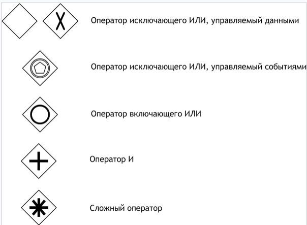
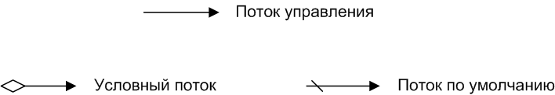
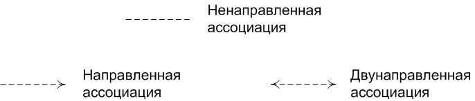
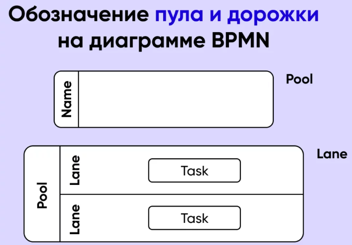

# BLPS - LAB1

## ВОПРОСЫ

### 1. 软件系统中的业务逻辑的概念；软件系统的多级架构中的业务逻辑层
1. 业务逻辑层：是连接表示层和数据访问层之间的桥梁，负责处理用户请求，执行必要的操作，以确保数据的正确性和一致性。<br>
`Уровень бизнес-логики: это мост между уровнем представления и уровнем доступа к данным. Он отвечает за обработку запросов пользователей и выполнение необходимых операций для обеспечения правильности и согласованности данных.`
    - 业务规则：定义业务流程中的条件等；<br>
   `Бизнес-правила: определяют условия в бизнес-процессах и т.д.;`
    - 流程管理：确定业务操作的顺序和流程；<br>
   `Управление процессами: определение последовательности и процесса бизнес-операций;`
    - 数据处理：确保数据的准确性和完整性；<br>
   `Обработка данных: обеспечение точности и полноты данных;`
    - ...
2. 多级架构中的业务逻辑层：负责处理用户请求，执行业务规则和流程，以及与数据存储交互的工作，包括：<br>
`Уровень бизнес-логики в многоуровневой архитектуре: отвечает за обработку запросов пользователей, выполнение бизнес-правил и процессов, а также взаимодействие с хранилищем данных, в том числе:`
   - 业务逻辑处理：根据用户请求进行相应的操作；<br>
   `Обработка бизнес-логики: выполнение соответствующих операций по запросам пользователей;`
   - 事务管理：通过事务来管理多个数据库操作的执行；<br>
   `Управление транзакциями: управление выполнением нескольких операций с базой данных посредством транзакций;`
   - 安全性控制：实施身份验证和授权机制，限制用户对系统资源的访问；<br>
   `Контроль безопасности: реализация механизмов аутентификации и авторизации для ограничения доступа пользователей к системным ресурсам;`
   - 异常处理：处理业务逻辑中可能出现的异常情况<br>
   `Обработка исключений: обработка исключений, которые могут возникнуть в бизнес-логике.`

### 2. 开发业务逻辑时使用的基本概念：CDI，IoC，事务管理，安全，分布式数据处理
1. CDI（Contexts and Dependency injection）：
   - Java EE 一项规范，用于管理应用程序中的依赖关系和生命周期；<br>
   `Java EE Спецификация для управления зависимостями и жизненными циклами приложений;`
   - 利用依赖注入实现对象之间的解耦，提高代码的可维护性<br>
   `Используйте внедрение зависимостей для разделения объектов и улучшения удобства сопровождения кода.`
2. IoC（Inversion of Control）：
   - 是一种设计模式，将控制权从应用程序代码转移到外部容器或框架；<br>
   `Является шаблоном проектирования, передающим управление от кода приложения внешнему контейнеру или фреймворку;`
   - 可以将对象的创建和管理交由容器完成，降低组件之间的耦合度<br>
   `Создание объектов и управление ими можно передать в контейнер, чтобы уменьшить связь между компонентами.`
3. 事务管理：
    - 是确保数据库操作的一致性和完整性的重要机制；<br>
   `Это важный механизм, обеспечивающий согласованность и целостность операций базы данных;`
    - 将一系列的数据库操作作为一个单元，要么全部成功提交，要么全部失败回滚<br>
   `Рассматривать серию операций с базой данных как единое целое: либо все выполняются успешно, либо все завершаются неудачей и откатываются.`
4. 安全：
    - 保护系统资源和数据受到未经授权访问和恶意攻击；<br>
   `Защитить системные ресурсы и данные от несанкционированного доступа и вредоносных атак;`
    - 可以通过实施身份验证和授权机制，数据加密，防止跨站脚本攻击（XSS），跨站请求伪造（CSRF）等方式加强系统的安全性<br>
   `Безопасность системы можно повысить за счет реализации механизмов аутентификации и авторизации, шифрования данных, предотвращения атак с использованием межсайтовых сценариев (XSS), подделки межсайтовых запросов (CSRF) и т. д.`
5. 分布式数据处理：
   - 是在多个计算机或服务器上处理和存储数据的一种方法<br>
   `это метод обработки и хранения данных на нескольких компьютерах или серверах.`

### 3. 业务流程建模：BPM 和 BPMN
1. BPM（业务流程建模）：<br> `моделирование бизнес-процессов`
   - 灵活性：BPM包括多种不同的建模技术，如流程图、数据流程图等，以适应不同的需求和场景。<br>
   `Гибкость: BPM включает в себя множество различных методов моделирования, таких как блок-схемы, диаграммы потоков данных и т. д., для адаптации к различным потребностям и сценариям.`
   - 综合性：涵盖了整个业务流程的生命周期管理。<br> 
   `Комплексный: охватывает управление жизненным циклом всего бизнес-процесса.`
2. BPMN（业务流程模型与符号）：<br> `модель и обозначения бизнес-процессов`
   - 标准化：BPMN提供了一套标准化的符号和约定，用于描述业务流程中的活动、事件、网关等元素。<br>
   `Стандартизация: BPMN предоставляет набор стандартизированных символов и соглашений для описания действий, событий, шлюзов и других элементов бизнес-процессов.`
   - 可视化：BPMN使用图形化的表示方式，使得业务流程可以以直观的形式呈现出来。<br>
   `Визуализация: BPMN использует графическое представление, поэтому бизнес-процессы могут быть представлены в интуитивно понятной форме.`
   - 层次结构：BPMN支持不同层次的抽象，使得用户可以根据需要选择合适的抽象级别进行建模，从而更好地理解和管理业务流程。<br>
   `Иерархическая структура: BPMN поддерживает различные уровни абстракции, позволяя пользователям выбирать соответствующий уровень абстракции для моделирования в соответствии со своими потребностями, тем самым улучшая понимание и управление бизнес-процессами.`

BPM是一个更宽泛的概念，强调业务流程的综合管理；<br>
`BPM — более широкое понятие, в котором особое внимание уделяется комплексному управлению бизнес-процессами`
<br>BPMN是一种具体的标准，提供了一套统一的符号和语法，用于图形化表示业务流程，使得业务流程的建模和分析更加标准化和规范化。<br>
`BPMN — это специфический стандарт, предоставляющий унифицированный набор символов и синтаксиса для графического представления бизнес-процессов, что делает моделирование и анализ бизнес-процессов более стандартизированным и стандартизированным.`

### 4. BPMN2.0 规范；业务流程模型的编制原理和基本要素
BPMN：Business Process Modeling Notation 业务流程建模语言<br>
BPMN 2.0：BPMN标准。业务流程模型与符号建模标准，以XML为载体，以符号可视化业务。<br>
`BPMN 2.0：стандарт BPMN. Стандарты моделей бизнес-процессов и символического моделирования используют XML в качестве носителя для визуализации бизнеса с помощью символов.`

1. 业务流程模型的编制原理：<br> `Принцип составления модели бизнес-процесса`
   1. 需求分析 `Анализ требований`
   2. 建模过程 `Процесс моделирования`
   3. 验证和优化 `Проверка и оптимизация`
   4. 实施和监控 `Реализация и мониторинг`

2. 基本要素：
   1. 流程图（Process Diagram）：<br> `Схема процесса`
      - 流程图是 BPMN 中描述业务流程的主要视图。它包括各种流程元素以及它们之间的关系。<br>
      `Диаграмма процессов — это основной вид в BPMN для описания бизнес-процессов. Он включает в себя различные элементы процесса и связи между ними.`
   2. 流程元素（Flow Elements）：<br> `Элементы потока`
      - 流程元素是构成流程图的基本组成部分<br> `Элементы процесса – это основные строительные блоки блок-схем`
      - 常见的流程元素包括任务（Task）、事件（Event）、网关（Gateway）和流程连接对象（Sequence Flow）等。<br>
      `Общие элементы процесса включают задачу, событие, шлюз, поток операций и т.д.`
   3. 任务（Task）：
      - 任务表示业务流程中的具体工作或操作。<br>
      `Задачи представляют собой конкретную работу или операции в бизнес-процессе. Это может быть атомарная операция или сложная операция, которую необходимо дополнительно разделить на подзадачи.`
      - BPMN 2.0 中的任务包括用户任务、服务任务、接收任务、发送任务等不同类型。<br>
      `Задачи в BPMN 2.0 включают в себя различные типы, такие как задачи пользователя, задачи обслуживания, задачи получения и задачи отправки.`
   4. 事件（Event）：<br> `Событие`
      - 事件表示业务流程中的状态变化或者引发流程执行的触发器。它可以是开始事件、中间事件或结束事件。<br>
      `События представляют собой изменения состояния бизнес-процесса или триггеры, вызывающие выполнение процесса. Это может быть начальное событие, промежуточное событие или конечное событие.`
      - 常见的事件类型包括消息事件、定时事件、信号事件、错误事件等。<br>
      `Общие типы событий включают события сообщения, события синхронизации, события сигнала, события ошибки и т. д.`
   5. 网关（Gateway）：<br> `Шлюз`
      - 网关用于控制流程的分支、合并和转移。它根据特定条件确定流程的执行路径。<br>
      `Шлюзы используются для управления ветвлением, слиянием и переносом процессов. Он определяет путь выполнения процесса на основе конкретных условий.`
   6. 流程连接对象（Sequence Flow）：<br> `поток операций`
      - 表示流程执行的顺序和方向。<br> `Указывает порядок и направление выполнения процесса.`
   7. 数据对象（Data Object）：<br> `Объект данных`
      - 表示业务流程中使用的数据或信息。<br> `Представляет данные или информацию, используемые в бизнес-процессе.`

### 5. BPMN 中的控制，角色，工件流对象
1. 控制流对象：
   - 事件 `событие`
   - 任务或活动 `задача или деятельность`
   - 网关 `Шлюз` <br>
   
2. 连接对象 `Соединяющие объекты`
   - 控制流 `Поток управления ` <br>
     
   - 消息流 `Поток сообщений ` <br>
   
   - 关联 `Ассоциация` <br>
   
3. 角色流对象：
   - 泳池 `пул`
   - 泳道 `дорожка` <br>
   
4. 工件流对象：
   - 数据 `Данные `
   - 组 `Группа `
   - 文本注释 `Текстовые аннотации` <br>
   

### 6. 使用 Spring Framework 实现业务逻辑；CDI 和 IoC 的实施；Spring 中业务逻辑层与其他软件系统架构层的关系
1. 使用 Spring Framework 实现业务逻辑：<br> `Используйте Spring Framework для реализации бизнес-логики:`
   1. 配置Spring环境：<br> `Настройте среду Spring:`
      - 首先，需要在项目中集成Spring Framework。可以使用Maven或Gradle等构建工具添加Spring依赖项。<br> 
      `Во-первых, Spring Framework необходимо интегрировать в проект. Зависимости Spring можно добавить с помощью инструментов сборки, таких как Maven или Gradle.`
      - 创建Spring配置文件，如XML配置文件（applicationContext.xml）或Java配置类（使用@Configuration注解）。<br> 
      `Создайте файлы конфигурации Spring, такие как файлы конфигурации XML (applicationContext.xml) или классы конфигурации Java (с аннотацией @Configuration).`
   2. 编写业务逻辑类：<br> `Написать класс бизнес-логики:`
      - 实现具体的业务功能。<br> 
      `Реализуйте конкретные бизнес-функции.`
      - 可以注入其他依赖的组件，如数据访问对象（DAO）、服务等。<br>
      `можете внедрить другие зависимые компоненты, такие как объекты доступа к данным (DAO), службы и т. д.`
   3. 使用Spring的依赖注入：<br> `Использование внедрения зависимостей Spring:`
      - 使用Spring的依赖注入机制来管理组件之间的依赖关系。<br> 
      `Используйте механизм внедрения зависимостей Spring для управления зависимостями между компонентами.`
      - 通过在业务逻辑类中声明需要注入的依赖项，Spring会负责在运行时将相应的依赖注入到业务逻辑类中。<br> 
      `Объявляя зависимости, которые необходимо внедрить в класс бизнес-логики, Spring будет отвечать за внедрение соответствующих зависимостей в класс бизнес-логики во время выполнения.`
   4. 声明事务管理：<br> `Управление транзакциями выписок:`
      - 在需要事务支持的业务逻辑方法上添加事务注解（如@Transactional），以确保方法的执行在事务的上下文中进行。<br> 
      `Добавляйте аннотации транзакций (например, @Transactional) к методам бизнес-логики, требующим поддержки транзакций, чтобы гарантировать выполнение метода в контексте транзакции.`
   5. 编写单元测试：<br> `Написание модульных тестов:`
      - 验证业务逻辑的正确性。<br> `Проверить корректность бизнес-логики.`
   6. 集成其他Spring模块：<br> `Интегрируйте другие модули Spring:`
      - 根据需要集成其他Spring模块，如Spring Data用于数据访问、Spring Security用于安全认证、Spring MVC用于Web开发等。<br> 
      `При необходимости интегрируйте другие модули Spring, такие как Spring Data для доступа к данным, Spring Security для аутентификации безопасности, Spring MVC для веб-разработки и т. д.`
   7. 部署和运行：<br> `Развертывание и запуск:`
      - 部署应用程序并启动容器（如Tomcat、Jetty等），让Spring框架管理应用程序的生命周期和依赖关系。<br>
      `Разверните приложение и запустите контейнер (например, Tomcat, Jetty и т. д.) и позвольте платформе Spring управлять жизненным циклом приложения и зависимостями.`
      - 使用Spring的IoC容器来创建和管理业务逻辑类的实例，确保它们能够正确地被初始化和销毁。<br>
      `Используйте контейнер IoC Spring для создания экземпляров классов бизнес-логики и управления ими, гарантируя их правильную инициализацию и уничтожение.`

2. CDI 和 IoC 的实施：<br> 
   - IoC容器：`Контейнер IoC:`
      - Spring Framework 提供了一个IoC容器，负责管理应用程序中的对象生命周期、依赖关系和配置。<br> 
     `Spring Framework предоставляет контейнер IoC, который отвечает за управление жизненным циклом объекта, зависимостями и конфигурацией в приложении.`
      - 通过IoC容器，应用程序的对象不再负责自己的创建和管理，而是由容器来负责，从而实现了控制反转。<br> 
     `Через IoC-контейнер объекты приложения больше не отвечают за собственное создание и управление, а контейнер несет ответственность, таким образом достигается инверсия управления.`
   - 依赖注入：<br> `Внедрение зависимостей:`
     - 依赖注入是IoC的一种实现方式，它通过将对象的依赖关系从代码中解耦，由容器在运行时动态地注入依赖对象。<br> 
     `Внедрение зависимостей — это метод реализации IoC. Он отделяет зависимости объектов от кода и позволяет контейнеру динамически внедрять зависимые объекты во время выполнения.`
     - Spring通过构造器注入、属性注入或者方法注入等方式实现依赖注入。<br> 
     `Spring реализует внедрение зависимостей посредством внедрения конструктора, внедрения свойств или внедрения метода.`

3. Spring 中业务逻辑层与其他软件系统架构层的关系：<br> `Взаимосвязь между уровнем бизнес-логики и другими уровнями архитектуры программной системы в Spring:`
   1. 与表示层的关系：<br> `Связь с уровнем представления:`
      - 业务逻辑层通常位于应用程序的中间层，负责处理表示层（如控制器或者Servlet）发送过来的请求，并返回相应的结果。<br> 
      `Уровень бизнес-логики обычно расположен на среднем уровне приложения и отвечает за обработку запросов, отправленных уровнем представления (например, контроллером или сервлетом), и возврат соответствующих результатов.`
      - Spring Framework中的控制器（如Spring MVC中的Controller）可以调用业务逻辑层的服务来执行业务逻辑，并将结果返回给表示层。<br> 
      `Контроллеры в Spring Framework (например, контроллеры в Spring MVC) могут вызывать службы уровня бизнес-логики для выполнения бизнес-логики и возврата результатов на уровень представления.`
   2. 与持久层的关系：<br> `Связь с уровнем персистентности:`
      - 业务逻辑层通常需要与持久层（如数据库访问层）进行交互，读取或者存储数据以支持业务逻辑的执行。<br> 
      `Уровень бизнес-логики обычно должен взаимодействовать с уровнем персистентности (например, уровнем доступа к базе данных) для чтения или хранения данных для поддержки выполнения бизнес-логики.`
      - Spring Framework提供了对持久层的支持，可以使用Spring Data JPA、Spring JDBC等技术来简化数据访问层的开发。<br> 
      `Spring Framework обеспечивает поддержку уровня персистентности, и вы можете использовать Spring Data JPA, Spring JDBC и другие технологии для упрощения разработки уровня доступа к данным.`

### 7. Spring Boot；Bean 的配置方法；两相，三相构造器
1. Spring Boot
   - 是Spring Framework的一个扩展，旨在简化基于Spring的应用程序的开发和部署过程。它提供了一系列约定和自动配置，可以快速地构建独立的、生产级别的Spring应用程序。<br> 
   `это расширение Spring Framework, предназначенное для упрощения процесса разработки и развертывания приложений на основе Spring. Он предоставляет ряд соглашений и автоматическую настройку для быстрого создания независимых приложений Spring производственного уровня.`
2. Spring Boot中Bean的配置方法：<br> `Метод настройки bean-компонента в Spring Boot:`
   1. 自动装配：<br> `Автоматическая сборка:`
      - Spring Boot通过自动装配来简化Bean的配置。它根据应用程序的类路径、注解和约定，自动配置和注册所需的Bean。<br> 
      `Spring Boot упрощает настройку Bean за счет автоматического подключения. Он автоматически настраивает и регистрирует необходимые bean-компоненты на основе пути к классам приложения, аннотаций и соглашений.`
      - 例如，Spring Boot会根据类路径上的依赖自动配置数据库连接池、Web服务器等常用的组件。<br> 
      `Например, Spring Boot автоматически настроит общие компоненты, такие как пулы подключений к базе данных и веб-серверы, на основе зависимостей пути к классам.`
   2. 注解配置：<br> `Конфигурация аннотации:`
      - Spring Boot支持使用注解来配置Bean，如：<br> `Spring Boot поддерживает использование аннотаций для настройки bean-компонентов, например:`
        - `@Component`、`@Service`、`@Repository`等注解用于标识组件 <br> `@Component, @Service, @Repository и другие аннотации используются для идентификации компонентов`
        - `@Configuration`用于定义配置类 <br> `@Configuration используется для определения классов конфигурации`
        - `@Bean`用于声明Bean。在配置类中使用`@Bean`注解，可以手动创建和配置Bean，并将其注册到Spring的应用上下文中。<br> 
        `@Bean используется для объявления Bean. Используя аннотацию @Bean в классе конфигурации, вы можете вручную создать и настроить Bean и зарегистрировать его в контексте приложения Spring.`
   3. 外部化配置：<br> `Внешняя конфигурация:`
      - 可以使用properties文件、YAML文件、环境变量等方式来配置Bean的属性。<br> 
      `Свойства компонента можно настроить с помощью файлов свойств, файлов YAML, переменных среды и т.д.`

3. 两相和三相构造器：<br> `Двухфазные и трехфазные конструкторы:`
   1. 两相构造器：<br> `Двухфазный конструктор:`
      - 两相构造器是指构造函数接受两个参数的情况。在Spring中，通常用于注入两个相关联的依赖项。<br> 
      `Двухфазный конструктор — это когда конструктор принимает два параметра. В Spring это обычно используется для внедрения двух связанных зависимостей.`
      - 例如，在一个服务类中，可能需要同时注入数据访问对象和日志记录器，这时可以使用两相构造器来注入这两个依赖项。<br> 
      `Например, в классе обслуживания вам может потребоваться внедрить как объект доступа к данным, так и средство ведения журнала. В этом случае вы можете использовать двухфазный конструктор для внедрения этих двух зависимостей.`
   2. 三相构造器：<br> `Трехфазный конструктор:`
      - 三相构造器是指构造函数接受三个参数的情况。在Spring中，通常用于注入更多的依赖项或配置信息。<br> 
      `Трехфазный конструктор — это когда конструктор принимает три параметра. В Spring это обычно используется для добавления дополнительных зависимостей или информации о конфигурации.`
      - 例如，在一个服务类中，可能需要同时注入数据访问对象、日志记录器和配置对象，这时可以使用三相构造器来注入这些依赖项。<br> 
      `Например, в классе обслуживания вам может потребоваться одновременно внедрить объекты доступа к данным, средства ведения журнала и объекты конфигурации. В этом случае вы можете использовать трехфазный конструктор для внедрения этих зависимостей.`

### 8. Spring Boot 中的应用程序启动配置文件
在Spring Boot中，应用程序的启动配置文件主要是 `application.properties/yml`。用于配置应用程序的各种属性、环境变量、数据源、日志级别等信息。<br> 
`В Spring Boot файл конфигурации запуска приложения в основном называется application.properties/yml. Используется для настройки различных свойств, переменных среды, источников данных, уровней журнала и другой информации приложения.`

1. application.properties：
   - key=value，用于配置Spring Boot应用程序的属性和参数。<br> `Свойства и параметры для настройки приложений Spring Boot`
   - 放置在 src/main/resources 目录下，Spring Boot会自动加载并解析其中的配置信息。<br> 
   `Размещенный в каталоге src/main/resources, Spring Boot автоматически загрузит и проанализирует информацию о конфигурации.`
   ```properties
   # 服务器端口
   server.port=8080
   
   # 数据库连接配置
   spring.datasource.url=jdbc:mysql://localhost:3306/mydatabase
   spring.datasource.username=root
   spring.datasource.password=secret
   
   # 日志级别
   logging.level.root=INFO
   ```
2. application.yml：
   - application.yml 是一个基于 YAML 格式的配置文件，它使用缩进和层级结构来表示属性之间的关系。<br> 
   `application.yml — это файл конфигурации, основанный на формате YAML, который использует отступы и иерархическую структуру для выражения взаимосвязи между свойствами.`
   - 相比于 application.properties，application.yml 更具有可读性和易用性。<br> 
   `По сравнению с application.properties, application.yml более читаем и прост в использовании.`
   ```yaml
   server:
     port: 8080
   
   spring:
     datasource:
       url: jdbc:mysql://localhost:3306/mydatabase
       username: root
       password: secret
   
   logging:
     level:
       root: INFO
   ```